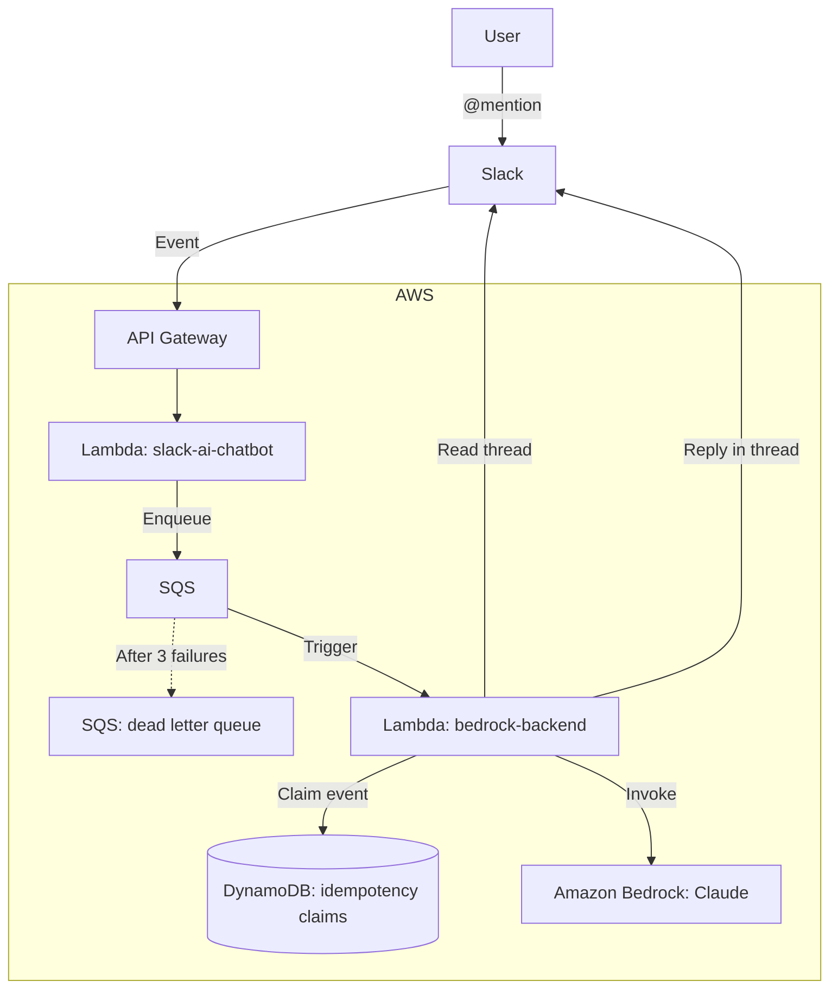

# bedrock-slack-ai-chatbot

A Slack AI chatbot backed by Amazon Bedrock. Mention it and it answers in the thread,
reading the thread it was mentioned in for context — including the parts of the
conversation it was never involved in.

Functions as an HTTP API server using API Gateway.

***
This Project was created with reference to the following:
[Amazon BedrockとSlackで生成AIチャットボットアプリを作る (その2：Lambda＋API Gatewayで動かす)](https://dev.classmethod.jp/articles/amazon-bedrock-slack-chat-bot-part2/)

### Architecture Diagram



***
### Resources Created

`terraform apply` creates everything inside the `AWS` box above:

| Resource | Notes |
|---|---|
| API Gateway (HTTP API) | `POST /slack/events`, access logging enabled |
| Lambda x2 + layer x2 | the Slack-facing frontend and the Bedrock backend |
| SQS queue + dead letter queue | the async handoff between them |
| DynamoDB table | idempotency claims only, no conversation state |
| Bedrock inference profile | Claude, referenced by the backend Lambda |
| IAM roles and policies | one per Lambda, scoped to the resources it touches |
| CloudWatch log groups | one per Lambda plus one for API Gateway |

***
## How To Use

**Mention @app_name and it replies in the thread.**

Follow-ups work because the bot reads the thread each time, so it picks up both its own
earlier replies and anything the humans said in between:

```
You:  @bot Pythonのリスト内包表記って何？
Bot:  [スレッドに返信] リスト内包表記は...

You:  (スレッド内) @bot じゃあ辞書版は？
Bot:  (スレッド内) 辞書内包表記は...  ← 前の文脈を踏まえて回答
```

The same mechanism means you can drop a bare question into a discussion the bot was
never part of:

```
haruka  08:12  〇〇について語るスレ
haruka  08:12  ロググループ保護有効化したほうがいいなー
haruka  08:12  @bot どうおもう？
bot     08:13  [スレッドの内容を踏まえて回答]
```

***
## Where conversation state lives

**In Slack, and nowhere else.** Context is read back from the thread with
`conversations.replies` rather than kept in a store of its own.

That is not only how the bot answers a bare "どう思う？" — it is also one source of truth
instead of two that can drift apart. Storing history separately meant recording only the
turns the bot took part in, so a thread where people talked among themselves was
invisible to it, and the stored copy could disagree with what the user could plainly see.
Reading the thread also removes the optimistic-concurrency version, the read-modify-write
race between two mentions, and the ordering trade-off between saving and posting: there
is no longer anything to write.

DynamoDB is still there, holding idempotency claims only.

### Turning a thread into a conversation

Slack threads do not look like the alternating user/assistant conversation Bedrock
wants, so the messages are reshaped:

- Messages with a `bot_id` become `assistant` turns; everything else becomes `user`.
- Consecutive messages from the same side are folded into one turn — a thread happily
  runs five human messages in a row.
- `<@U…>` mentions are stripped, so the model cannot echo one back and ping somebody who
  was not part of the conversation.
- The bot's own canned failure messages are filtered out; feeding old failures back as
  context teaches the model to produce more of them.
- Anything posted *after* the question is left out. While the question waited in the
  queue the thread may have moved on.

Speakers are not labelled. Telling them apart would need `users:read` plus a lookup per
participant, and putting raw `<@U…>` ids in the prompt risks the model echoing a real
ping. Folding consecutive messages covers the common single-author case.

Note that this sends the whole thread to Bedrock, including messages that were not
addressed to the bot.

***
## Why the queue

Slack gives an event endpoint 3 seconds to respond, and a Bedrock call takes far longer,
so the answer has to be produced outside the request. SQS carries that handoff rather
than an asynchronous Lambda invoke because Bedrock quotas are much lower than Lambda's
default concurrency: the event source mapping's `maximum_concurrency` caps how many
requests reach the model at once, `maxReceiveCount` plus the visibility timeout give
throttled requests a real retry, and the dead-letter queue keeps whatever still failed.

The pieces that keep it honest, and what breaks without each:

| Setting | Value | Without it |
|---|---|---|
| `visibility_timeout_seconds` | 180 (6x the function timeout) | A slow invocation has its message redelivered while still running, and the thread gets two answers |
| `message_retention_seconds` (queue) | 900 | A backlog silently deletes the question |
| `message_retention_seconds` (DLQ) | 14 days | Failures vanish before anyone can look at them |
| `maxReceiveCount` | 3 | A hard failure never reaches the handler, so nobody tells the user |
| `maximum_concurrency` | 5 | A burst fans out and every call is throttled at once |

### Where retries actually happen

Queue redelivery cannot arrive sooner than the visibility timeout, which makes it
useless for *answering*: by the time the message comes back, the answer is 180 seconds
late and nobody wants it. So the two kinds of retry are separated.

- **Throttling is retried inside the invocation.** The Bedrock client runs in adaptive
  retry mode, which backs off in seconds and keeps the answer timely. This is the only
  retry that ever produces an answer.
- **Queue redelivery exists to inform, not to answer.** The backend refuses to answer a
  question older than `ANSWER_DEADLINE_SECONDS` (60) and posts a short "I gave up"
  message in the thread instead.

That is why retention is generous while the deadline is tight. They are not the same
knob: retention only decides when a message disappears with nobody noticing, and the
deadline decides whether an answer is still worth having. A question that ages out is
never answered late and never silently dropped — the thread is told once.

Delivery is at-least-once at two points, and both are handled in code rather than
assumed away:

- **Slack retries** a delivery it thinks failed. The frontend recognises the
  `X-Slack-Retry-Num` header, acknowledges, and enqueues nothing.
- **SQS redelivers.** The frontend forwards Slack's `event_id`; the backend takes an
  expiring claim on it in DynamoDB before doing any work, and releases the claim if
  processing fails so the retry is allowed through.

Two mentions racing in the same thread need no coordination at all, because neither one
writes conversation state — each reads the thread as it stands and answers.

***
## Installation Guide

### Prerequisites
- Terraform installed on your local machine
- AWS CLI configured with appropriate credentials
- A Slack app created with bot token and signing secret

### Required Slack bot token scopes

Reading the thread for context needs a history scope, which is **not** something
Terraform can set — it lives in the Slack app configuration, and adding it requires
reinstalling the app to the workspace.

| Scope | Needed for |
|---|---|
| `app_mentions:read` | receiving the mention |
| `chat:write` | replying in the thread |
| `channels:history` | reading thread context in public channels |
| `groups:history` | reading thread context in private channels |

Add them under *OAuth & Permissions → Bot Token Scopes*, then **Reinstall to Workspace**.

Until the scope is granted, `conversations.replies` fails and the bot answers from the
mention text alone — degraded, not broken. That is deliberate, so deploying before
reinstalling the app does not take the bot down. The fallback logs
`Could not read thread ...`, which is the quickest way to tell a missing scope from a
model that simply gave a poor answer.

### Terraform variables

| Variable | Required | Default | Purpose |
|---|---|---|---|
| `slack_bot_token` | yes | — | Slack Bot User OAuth Token (sensitive) |
| `slack_signing_secret` | yes | — | Slack Signing Secret (sensitive) |
| `region` | no | `ap-northeast-1` | AWS region |
| `env` | no | `production` | value of the `Environment` tag |
| `bedrock_max_tokens` | no | `1000` | cap on generated tokens per reply |

### Steps

1. Clone the repository to your local machine.

2. Navigate to the project directory.

3. Set up Terraform variables:
 - Option A: set variable in HCP Terraform

   ```hcl
   slack_bot_token      = "your-slack-bot-token"
   slack_signing_secret = "your-slack-signing-secret"
   ```
 - Option B: Local environment, e.g., Ubuntu

   first, Open variables.tf and change the variable names to uppercase

   then add env var

   ```bash
   export SLACK_BOT_TOKEN="your-slack-bot-token"
   export SLACK_SIGNING_SECRET="your-slack-signing-secret"
   ```

    Replace your-slack-bot-token and your-slack-signing-secret with your actual Slack App values.

4. Initialize Terraform:
   ```
   terraform init
   ```

5. Apply the Terraform configuration:
   ```
   terraform apply
   ```

   Review the planned changes and type `yes` when prompted to create the resources.

6. After the apply is complete, note the API Gateway endpoint URL in the Terraform output.

7. Configure Slack:
   - Go to your Slack App's configuration page
   - Navigate to "Event Subscriptions"
   - Enable events
   - In the "Request URL" field, enter: `{your-api-endpoint}/slack/events`
     Replace `{your-api-endpoint}` with the actual API Gateway endpoint URL from step 6.
   - Under *Subscribe to bot events*, add **`app_mention`**. Without it Slack never
     delivers anything and the endpoint stays silent.

8. Save the Slack App configuration.

9. Add the bot token scopes listed above and **Reinstall to Workspace**.

10. Invite the bot to the channel (`/invite @app_name`). A history scope alone does not
    let it read a channel it is not a member of.

Your Slack AI chatbot should now be ready to use!

***
## Tuning

These live as module constants in `lambda_function_bedrock_backend/lambda_function.py`,
alongside a comment explaining what each one is protecting against.

| Constant | Value | What it controls |
|---|---|---|
| `ANSWER_DEADLINE_SECONDS` | 60 | How stale a question may be and still be answered rather than declined |
| `MAX_HISTORY_MESSAGES` | 20 | Turns of thread context sent to Bedrock |
| `MAX_HISTORY_CHARACTERS` | 24000 | Size cap on that context, a conservative proxy for tokens |
| `MAX_THREAD_MESSAGES` | 200 | Newest thread messages kept while reading |
| `MAX_THREAD_PAGES` | 10 | Pages of `conversations.replies` fetched before giving up |
| `CLAIM_TTL_SECONDS` | 180 | How long an idempotency claim blocks a redelivery; matches the queue's visibility timeout |

`ANSWER_DEADLINE_SECONDS` must stay below `CLAIM_TTL_SECONDS`, and `CLAIM_TTL_SECONDS`
must match `visibility_timeout_seconds` on the queue. A test asserts the first
relationship so the pair cannot silently drift apart.

***
## Development

Dependencies are managed with [uv](https://docs.astral.sh/uv/).

```bash
uv sync            # create .venv and install runtime + dev dependencies
uv run pytest      # run the test suite
uvx ruff check .   # lint
terraform fmt -recursive
```

### Tests

`tests/` holds unit tests for both Lambda handlers. They run entirely offline — every
AWS and Slack client is replaced with a mock before the handler module is imported, so
no credentials, no network and no LocalStack are needed.

| File | Covers |
|------|--------|
| `tests/test_slack_ai_chatbot_lambda.py` | mention parsing, thread root resolution, dropping Slack's retried deliveries, the SQS payload |
| `tests/test_bedrock_backend_lambda.py` | reading and reshaping the Slack thread, the Converse request/response, trimming, idempotency claims, the answer deadline |

Tests live at the repository root rather than inside the Lambda directories on purpose:
`lambda_function_slack_ai_chatbot/` and `lambda_function_bedrock_backend/` are zipped
verbatim by `data.archive_file`, so anything added there would ship to production and
change `source_code_hash`.

Both Lambda directories contain a module named `lambda_function`, so they cannot both be
imported by name in one pytest session. `tests/conftest.py` loads each from its file path
under a unique name, reloading per test so the injected mocks stay isolated.

### CI

`main` is protected: these checks are required, so a red build cannot be merged.

| Check name | Runs | Source |
|---|---|---|
| `pytest` | `uv run pytest` | `.github/workflows/python-test.yml` (this repo) |
| `ci / lint` | `uvx ruff check .` | reusable workflow, managed by Terraform |
| `ci / terraform fmt` | `terraform fmt -recursive -check` | reusable workflow, managed by Terraform |
| `ci / tflint` | `tflint -f compact` | reusable workflow, managed by Terraform |
| `ci / trivy (IaC misconfig)` | `trivy config .` | reusable workflow, managed by Terraform |
| `Terraform fmt checker` | `terraform fmt -recursive -check` | `.github/workflows/github-actions.yml` (this repo) |
| `Terraform Cloud` | speculative `terraform plan` | HCP Terraform VCS integration |

`python-ci.yml` and `terraform-ci.yml` are generated by Terraform in another repository
and must not be edited here; repo-specific checks go in their own file, as
`python-test.yml` does.

`Terraform fmt checker` duplicates `ci / terraform fmt` — it predates the reusable
workflow and is a candidate for removal.
