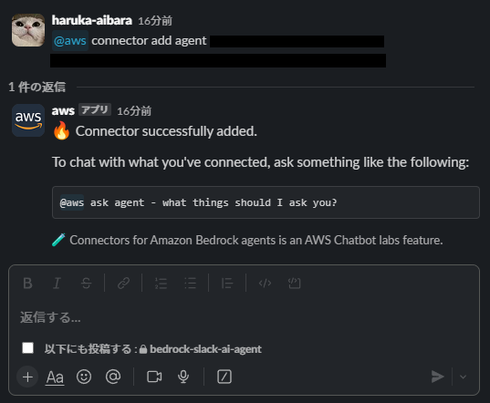

# bedrock-agent-classic-slack

Amazon Bedrock Agents（classic）のエージェントを、Amazon Q Developer in chat applications（旧 AWS Chatbot）の Slack チャンネル設定につなぎ、Slack から会話できるようにするモジュール。

旧リポジトリ `bedrock-slack-ai-agent` を履歴ごと取り込んだもの。過去の経緯は `git log -- modules/bedrock-agent-classic-slack` で辿れる。

## Bedrock Agents は classic 扱い

このモジュールが使う Amazon Bedrock Agents（2023年11月リリース）は **Amazon Bedrock Agents Classic** に改称され、2026-07-30 からメンテナンスモードに入っている。

- 新規顧客には開放されない。直近12か月に Bedrock Agents の利用がないアカウントは `CreateAgent` が `AccessDeniedException` になる
- 新機能は追加されず、使えるモデルもメンテナンスモード入りの時点で固定
- 既存利用者向けには動き続け、終了日は発表されていない
- AWS の推奨移行先は Amazon Bedrock AgentCore

そのため works からの呼び出しはコメントアウトしてある。いま作り直すなら AgentCore か、`modules/bedrock-slack-ai-chatbot` のように Lambda から Bedrock のモデルを直接呼ぶ構成にする。

参考: https://docs.aws.amazon.com/bedrock/latest/userguide/agents-classic-maintenance-mode.html

## 構成

```mermaid
architecture-beta
    group communication(logos:aws)[cloud]

    service agent(logos:aws)[Amazon Bedrock Agent] in communication
    service chatbot(logos:aws)[Amazon Q Developer in chat applications] in communication

    service slack(logos:slack-icon)[Slack]

    slack:R <--> L:chatbot
    chatbot:R <--> L:agent
```



- Bedrock エージェントとエイリアス（基盤モデルは Claude 3 Haiku、セッション要約のメモリー付き）
- エージェント実行ロール（基盤モデルの `InvokeModel` だけ）
- Slack チャンネル設定と、そのロール・ガードレール（このエイリアスへの `InvokeAgent` だけ）

## 使い方

```hcl
module "bedrock_agent_classic_slack" {
  source = "./modules/bedrock-agent-classic-slack"

  slack_team_id    = var.bedrock_agent_slack_team_id
  slack_channel_id = var.bedrock_agent_slack_channel_id
}
```

Slack ワークスペースは事前に Amazon Q Developer in chat applications のコンソールで認可しておく。

apply 後、Slack 側で以下を入力してコネクターを登録する（プライベートチャンネルなら先に `/invite @aws`）。ARN とエイリアス ID は output の `agent_arn` / `agent_alias_id`。

```text
@Amazon Q connector add {任意のコネクター名} {エージェントのARN} {エージェントのエイリアスID}
```



これでエージェントと会話できる。

```text
@Amazon Q ask {任意のコネクター名} 富士山の高さを教えてください。
```

エージェントの版が変わるとエイリアスが作り直されるので、既存のコネクターを消してから登録し直す。

```text
@Amazon Q connector delete {コネクター名}
```
