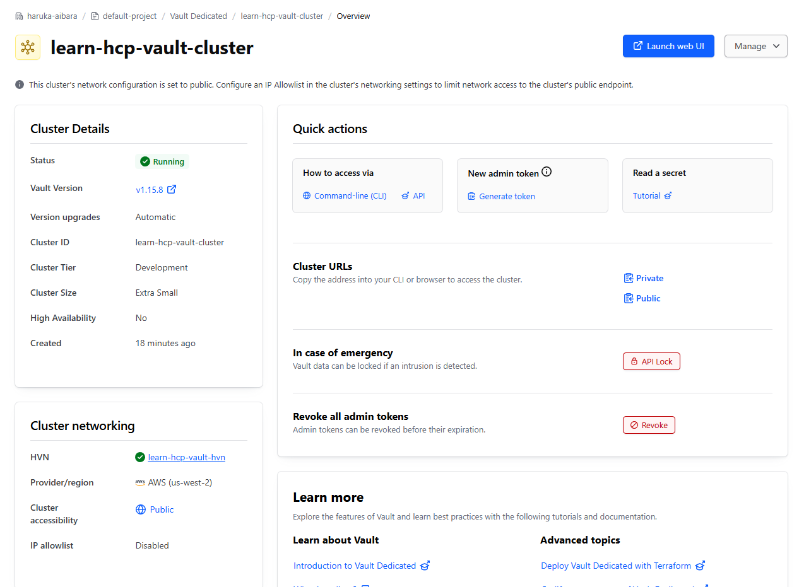
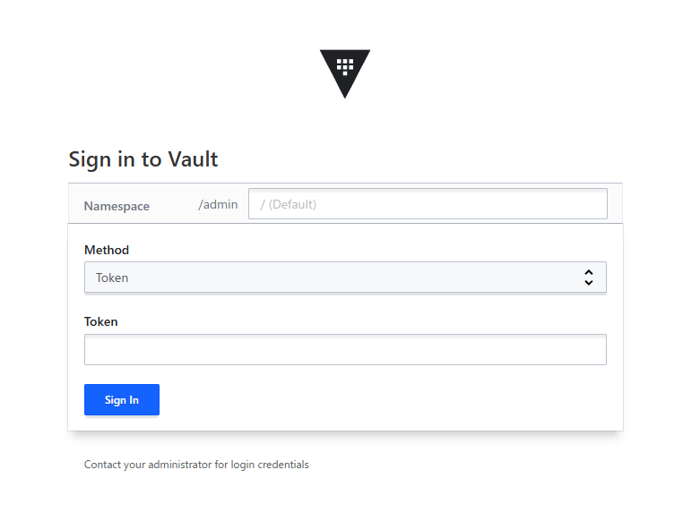

# hcp-vault

HCP Vault Dedicated のクラスターを立て、HVN と AWS の VPC をピアリングするモジュール。[HashiCorp のチュートリアル](https://developer.hashicorp.com/vault/tutorials/terraform-hcp-vault)をなぞったもの。

旧リポジトリ `deploy-hcp-vault-dedicated-with-terraform` を履歴ごと取り込んだもの。過去の経緯は `git log -- modules/hcp-vault` で辿れる。

## 使い方

```hcl
module "hcp_vault" {
  source = "./modules/hcp-vault"

  providers = {
    aws = aws.us-west-2
  }
}
```

- ピア側の VPC は渡した aws プロバイダーのリージョンに作られるので、`var.region`（既定 `us-west-2`）と揃える。
- hcp プロバイダーの認証は `HCP_CLIENT_ID` / `HCP_CLIENT_SECRET` 環境変数で渡す。
- クラスターは `public_endpoint = true` で外から見える。

## apply 後

HCP の画面で Cluster URLs の Public を押し、開いたリンクから Vault に入る。




